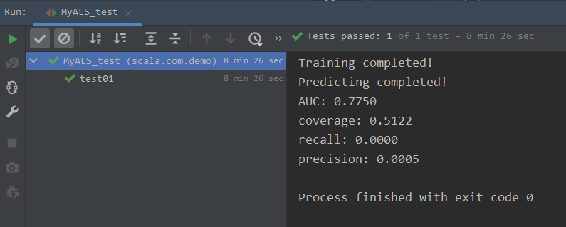

# RecSys_scala

## 基于 MLlib ALS 的 MyALS

### 模型概述

模型针对 MLlib 的 ALS 进行适度封装，向外保留训练和预测的接口，修改预测接口的输出的同时，添加了针对模型的评估函数，以及其他代码的封装。

#### 构造函数

模型的构造函数含有以下参数

| 参数名     | 含义                 | 默认值         |
| ---------- | -------------------- | -------------- |
| rank       | 隐向量长度           | 30             |
| iterations | ALS 算法迭代次数     | 10             |
| lambda     | 正则系数             | 0.1            |
| blocks     | 并行计算的分块数量   | -1（自动分配） |
| seed       | 随机初始化矩阵的种子 | 系统时间       |

#### 训练函数 fit()

训练函数接受一个 `RDD[Rating]` 格式的训练数据集，在预测与评测前需要首先调用该函数。返回的 `MatrixFactorizationModel` 类型变量可以通过调用 `getModel()` 获取。

#### 预测函数 predict()

预测函数接受预测数量作为参数，为每个用户推荐指定数量的物品，返回格式为 `RDD[Int, Iterable[Int]]`.

#### 评估函数 score()

评估函数接受如下参数

| 参数名         | 含义                            |
| -------------- | ------------------------------- |
| sc             | `SparkContext` 实例             |
| train          | 训练集数据                      |
| test           | 测试集数据                      |
| predictionDict | 预测函数 `predictDict()` 的结果 |
| _allItemIDs    | 由所有物品的 ID 组成的数组      |

评估函数返回由三个键值对，格式为 `Map[String, Double]`.

| 键名     | 含义           |
| -------- | -------------- |
| AUC      | ROC 曲线下面积 |
| RMSE     | 均方误差       |
| coverage | 覆盖率         |

### 算法评测

评测以 RMSE、AUC 和 coverage 三个方面衡量。

数据集方面，调整超参数时使用 [movielens: ml-latest-small](https://files.grouplens.org/datasets/movielens/ml-latest-small.zip) ，该数据集包含 610 位用户对 9000 余部电影的共计 100,836 条评价信息。

最终的评测使用 [movielens: ml-latest](https://files.grouplens.org/datasets/movielens/ml-latest.zip) ，该数据集包括 283,228 位用户对 58,000 余部电影的共计 27,753,445 条评价信息。

数据集按 7 : 3 的比例划分数据集与测试集，进行以下 12组实验。

| 组别   | rank   | iterations | lambda   | predictNum | RMSE       | AUC        | coverage   |
| ------ | ------ | ---------- | -------- | ---------- | ---------- | ---------- | ---------- |
| 1      | 30     | 20         | 0.001    | 80         | 0.4361     | 0.8019     | 32.84%     |
| 2      | 30     | 20         | 0.01     | 80         | 0.2863     | 0.8286     | 33.09%     |
| 3      | 30     | 20         | 0.1      | 80         | 0.1335     | 0.7797     | 28.55%     |
| 4      | 30     | 20         | 1        | 80         | 0.0143     | 0.5993     | 0.9%       |
| 5      | 30     | 20         | 0.01     | 50         | 0.2557     | 0.8283     | 26.51%     |
| **6**  | **30** | **20**     | **0.01** | **120**    | **0.3202** | **0.8231** | **37.26%** |
| 7      | 50     | 20         | 0.001    | 80         | 0.3580     | 0.8370     | 32.97%     |
| **8**  | **50** | **20**     | **0.01** | **80**     | **0.2070** | **0.8516** | **34.67%** |
| 9      | 50     | 20         | 0.1      | 80         | 0.1368     | 0.7737     | 29.19%     |
| 10     | 50     | 20         | 1        | 80         | 0.0266     | 0.6147     | 0.89%      |
| **11** | **50** | **20**     | **0.01** | **50**     | **0.1881** | **0.8502** | **30.05%** |
| 12     | 50     | 20         | 0.01     | 120        | 0.1745     | 0.8576     | 29.99%     |

**注**：`predictNum` 表示为用户推荐的物品的数量。

结合三种评测指标，最后选定以下 3 组参数组合使用千万级数据集对该组合进行评测，结果如下：

| 组别  | rank   | iterations | lambda   | predictNum | RMSE       | AUC        | coverage   | 运行时间    |
| ----- | ------ | ---------- | -------- | ---------- | ---------- | ---------- | ---------- | ----------- |
| **6** | **30** | **20**     | **0.01** | **120**    | **0.0581** | **0.7425** | **43.20%** | **59 min**  |
| 8     | 50     | 20         | 0.01     | 80         | 0.079      | 0.7070     | 25.98%     | 1 hrs 8 min |
| 11    | 50     | 20         | 0.01     | 50         | 0.0674     | 0.7704     | 38.98%     | 57 min      |

综合模型效果和训练时间，最后选定第 6 组作为该模型的**较优参数组合**。

### 问题记录

#### RDD 算子中变量修改失效问题

程序运行至计算覆盖率时，出现如下错误：

```scala
java.lang.ArithmeticException: / by zero

	at scala.com.demo.model.MyALS._calCoverage(MyALS.scala:104)
	at scala.com.demo.model.MyALS.score(MyALS.scala:190)
	at scala.com.demo.MyALS_test.test01(MyALS_test.scala:60)
	...
```

首先在错误附近打断点，监测变量值。

在 `item.foreach(t => itemSet.++(t._2.toSet))` 里， `item` 可以正常取到值，但 `itemSet` 集合始终为空。

另外，将添加操作更换为打印操作，系统可以输出 `t._2` 的值，因此推测是添加集合元素的方式不正确，导致 `itemSet.size` 返回 0，出现除零错误。

继续排查，发现两集合定义时使用了不可变的 `val`，遂将其改为 `var`. 但更改完成后依然报错。于是放弃连接集合，采用对集合内元素单独操作的方式。

```scala
item.foreach(
  t =>
   t._2.foreach(
     e =>
      itemSet + e
   )
)
```

依然报错！！！

为分母添加平滑项 1，使得分母不为 0，此时成功运行，得到的结果 `precision`、`recall` 和 `coverage` 均为0， 说明计算前两项时同样出错。

后续先后尝试：

1. 使用 `Iterable` 类型定义 `itemSet` 和 `recItemSet`，直到计算时再使用 `.toSet` 转换为集合，失败
2. 将项目设置涉及到 JDK 的选项全部设定为 1.8，失败
3. 将 `foreach` 改为普通的 for 循环，失败
4. 更新 IDEA 以及 scala 插件版本，失败
5. 不使用 `JUnit` 框架，使用普通的 object 测试，失败
6. 在 for 循环内，将 ` dict.foreach(t =>num += t._2.toSet)` 更改为自增一个常量值 ` dict.foreach(t =>num += 1)`，检查错误是否出现在自增项，失败

最后，尝试将 `Dict()` 更改为简单的 `List()`，

```scala
List(1, 2, 2, 432, 5, 345, 34, 56, 34, 6).foreach(
  t => num += t
)
```

结果不为 0，说明是**迭代对象 RDD**出现了问题。

查阅《Spark 快速大数据分析》6.2节 累加器，知 Spark 算子内的变量实际上是外部变量的副本，对其修改不能改变外部的变量。这是因为 RDD 是分布在多个机器上的，其算子也是如此，普通变量不能简单的在各个机器中同时修改。因此需要借助累加器 `Accumulator`，顾名思义该变量只能增加，只有 `driver` 能获取到 `Accumulator` 的值（使用 `value` 方法），Task 只能对其做增加操作。

对计算 precision、recall 和 coverage 分别使用 `DoubleAccumulator` 和 `CollectionAccumulator`，得到了正确的结果。

#### 未序列化问题

尝试将 `RDD[Int, Iterable[Int]]` 中的 `Iterable[Int]` 转换为 `RDD[Int]`，以便于进行求取交集的操作，但出现如下错误。

```
Exception in thread “main” org.apache.spark.SparkException: Task not serializable
... 
```

使用 `@transient` 对外部变量 `sc` 与 `sparkContext` 进行注解未解决问题，网络上未找到有效的解决办法。

最后考虑将 `Iterable[Int]` 转换为 `Set[Int]`，借助 `intersect()` 方法求两集合的交集。

#### 除法问题

评估时计算涉及除法，反复调试得到的结果均为 0.

于是先从 scala 简单的除法开始，考虑如下输出：

```
println(1 / 3)
println(1.0 / 3)
println(1.toLong / 3)
println(1.toDougle / 3)
```

第一个和第三个均输出 0，第二个和第四个有理想输出 0.3333...，因此计算时应使用 `.toDouble` 来确保除法的正确性。

#### 评测问题

最初的测试时出现以下测试结果：



`recall` 和 `precision` 的计算出现异常，考虑是数据在转换时出现错误。

这个问题直至最后依旧没有解决，通过查看每一步转化生成的数据，未发现错误，没有明显异常表明代码错误，故最后删除这两项评测指标。

**注**：这里覆盖率偏高，最后检查代码发现计算逻辑出现错误，修正后的覆盖率在 30% 左右。